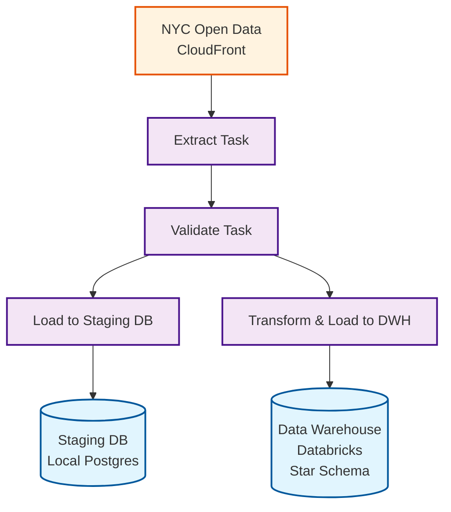

# TAX_BI

NYC Green Taxi Data Pipeline with Cloud OLAP Data Warehouse

## Overview

This project implements a complete ETL pipeline for NYC Green Taxi trip data, featuring:

- **Data Extraction** from NYC CloudFront API
- **Data Validation** and quality checks  
- **Staging Database** for raw data storage (Local PostgreSQL)
- **OLAP Data Warehouse** with star schema design (Databricks)
- **Automated Processing** with Apache Airflow
- **Docker-based** deployment for easy setup
- **Backfilling Support** for historical data processing
- **Utility Scripts** for data management

## Architecture



## Table of Contents

- [Data Warehouse Schema](#data-warehouse-schema)
- [Cloud Infrastructure](#cloud-infrastructure)
- [Prerequisites](#prerequisites)
- [Quick Start](#quick-start)
- [DAG Configuration](#dag-configuration)
- [Backfilling Data](#backfilling-data)
- [Utility Scripts](#utility-scripts)
- [SQL Scripts](#sql-scripts)
- [Monitoring](#monitoring)
- [Troubleshooting](#troubleshooting)

---

## Data Warehouse Schema

The OLAP data warehouse implements a **star schema** optimized for analytical queries using Databricks SQL Warehouse.

### Dimension Tables

#### 1. dim_date - Time Dimension
- **date_key** (PK) - Format: YYYYMMDD (e.g., 20240115)
- full_date
- year, quarter, month, day
- day_of_week (0=Sunday, 6=Saturday)
- day_name
- is_weekend, is_holiday
- season (Winter/Spring/Summer/Fall)

**Records**: 4,383 (2019-01-01 to 2030-12-31)

#### 2. dim_location - Geographic Dimension
- **location_key** (PK) - Matches NYC location IDs
- zone_name
- borough
- is_airport, is_downtown, is_tourist_area
- latitude, longitude

**Records**: 27+ (grows as new locations are encountered)

Key locations:
- Airports: JFK (132), LaGuardia (138), Newark (1)
- Tourist areas: Times Square (230), West Village (249)
- Business districts: Midtown Center (161), Penn Station (186)

#### 3. dim_vendor - Vendor Dimension
- **vendor_key** (PK) - Surrogate key (1, 2, -1)
- vendor_name
- is_active

**Records**: 3
- 1: Creative Mobile Technologies
- 2: VeriFone Inc.
- -1: Unknown

#### 4. dim_payment_type - Payment Method Dimension
- **payment_type_key** (PK) - Surrogate key (1-6, -1)
- payment_name
- is_electronic

**Records**: 7
- 1: Credit card (electronic)
- 2: Cash
- 3: No charge
- 4: Dispute
- 5: Unknown
- 6: Voided trip
- -1: Unknown

#### 5. dim_rate_code - Rate Code Dimension
- **rate_code_key** (PK) - Surrogate key (1-6, -1)
- rate_code_desc

**Records**: 7
- 1: Standard rate
- 2: JFK
- 3: Newark
- 4: Nassau or Westchester
- 5: Negotiated fare
- 6: Group ride
- -1: Unknown

### Fact Table

#### fact_trips - Trip Transaction Data
- **trip_id** (PK) - UUID string
- vendor_key (FK → dim_vendor)
- pickup_location_key (FK → dim_location)
- dropoff_location_key (FK → dim_location)
- payment_type_key (FK → dim_payment_type)
- rate_code_key (FK → dim_rate_code)
- pickup_date_key (FK → dim_date)
- passenger_count
- trip_distance_miles
- trip_duration_minutes
- fare_amount

**Key Features:**
- Foreign key constraints ensure referential integrity
- Indexes on all foreign keys for fast joins
- Partitioning-ready design for scalability

---

## Cloud Infrastructure

### Staging Database (Local PostgreSQL)
**Purpose:** Stores raw extracted data before transformation

- **Provider**: Local Docker Container
- **Host**: `postgres` (internal Docker network)
- **Port**: `5432`
- **Database**: `airflow`
- **User**: `airflow`

**Tables:** `green_taxi_YYYY_MM` (one per month)

### Data Warehouse (Databricks)
**Purpose:** OLAP analytics with star schema

- **Provider**: Databricks
- **Compute**: SQL Warehouse
- **Connection**: `databricks-sql-connector`

**Connection Configuration:**
Managed via Airflow Variable `dwh_db_creds` (JSON):
```json
{
  "SERVER_HOSTNAME": "...",
  "HTTP_PATH": "...",
  "ACCESS_TOKEN": "...",
  "CATALOG": "hive_metastore",
  "SCHEMA": "default"
}
```

### Key Design Decisions

**Simplified Surrogate Keys:**
The cloud schema uses direct surrogate keys without separate `_id` columns:
- ✅ `vendor_key` (no `vendor_id`)
- ✅ `payment_type_key` (no `payment_type_id`)
- ✅ `rate_code_key` (no `rate_code_id`)
- ✅ `location_key` (no `location_id`)

**Mapping Logic:**
- **VendorID** (1, 2) → **vendor_key** (1, 2, or -1 for unknown)
- **payment_type** (1-6) → **payment_type_key** (1-6, or -1 for unknown)
- **RatecodeID** (1-6) → **rate_code_key** (1-6, or -1 for unknown)
- **LocationID** → **location_key** (same value, or -1 for unknown)

---

## Prerequisites

- Docker and Docker Compose
- At least 4GB RAM
- 10GB free disk space
- Internet connection (for API access and cloud databases)

---

## Quick Start

### 1. Clone the Repository
```bash
git clone <repository-url>
cd TAX_BI
```

### 2. Create Environment File
```bash
echo "AIRFLOW_UID=$(id -u)" > .env
```

### 3. Start Services
```bash
docker compose up -d
```

Wait for all containers to be healthy (~2 minutes):
```bash
docker compose ps
```

### 4. Configure Credentials
Go to **Admin > Variables** in the Airflow UI and add the following variables:

**dwh_db_creds** (JSON):
```json
{
  "SERVER_HOSTNAME": "your-databricks-host.cloud.databricks.com",
  "HTTP_PATH": "/sql/1.0/warehouses/...",
  "ACCESS_TOKEN": "dapi...",
  "CATALOG": "hive_metastore",
  "SCHEMA": "default"
}
```

**stg_db_creds** (JSON):
```json
{
  "USER": "airflow",
  "PASSWORD": "airflow",
  "HOST": "postgres",
  "PORT": "5432",
  "DBNAME": "airflow"
}
```

### 5. Access Airflow UI
- **URL**: http://localhost:8080
- **Username**: `airflow`
- **Password**: `airflow`

### 5. Verify DAG
Navigate to DAGs and look for `nyc_green_taxi_pipeline`

---

## DAG Configuration

### Pipeline Tasks

```
start → extract → validate → load → check_schema → load_dwh → end
```

1. **start**: Initialization message
2. **extract**: Download parquet file from NYC CloudFront API
3. **validate**: Check data quality and record count
4. **load**: Load raw data to Local staging database
5. **check_schema**: Verify DWH schema exists (create if missing)
6. **load_dwh**: Transform and load to Databricks data warehouse
7. **end**: Completion message

### DAG Settings

```python
schedule='@monthly'           # Run monthly
start_date=datetime(2020, 1, 1)  # Historical start date
catchup=True                  # Enable backfilling
max_active_runs=3             # Run 3 months concurrently
```

### Manual Trigger

**Trigger for specific date:**
```bash
docker compose exec airflow-scheduler airflow dags trigger nyc_green_taxi_pipeline --exec-date "2024-10-01"
```

**Test run:**
```bash
docker compose exec airflow-scheduler airflow dags test nyc_green_taxi_pipeline 2024-10-10
```

---

## Backfilling Data

### What is Backfilling?

Backfilling allows you to process historical data by running the pipeline for past dates. The DAG is configured with `catchup=True` to support this.

### Create a Backfill

**Backfill specific date range:**
```bash
docker compose exec airflow-scheduler airflow backfill create \
  --dag-id nyc_green_taxi_pipeline \
  --from-date 2024-01-01 \
  --to-date 2024-12-31 \
  --max-active-runs 3
```

**Backfill options:**
- `--reprocess-behavior none`: Skip existing runs (default)
- `--reprocess-behavior failed`: Only reprocess failed runs
- `--reprocess-behavior completed`: Reprocess all runs
- `--max-active-runs N`: Limit concurrent runs
- `--run-backwards`: Process most recent first
- `--dry-run`: Test without executing

### Monitor Backfill Progress

**List all DAG runs:**
```bash
docker compose exec airflow-apiserver airflow dags list-runs nyc_green_taxi_pipeline
```

**Count successful runs:**
```bash
docker compose exec airflow-apiserver airflow dags list-runs nyc_green_taxi_pipeline | grep -c "success"
```

**Watch live progress:**
```bash
watch -n 10 'docker compose exec airflow-apiserver airflow dags list-runs nyc_green_taxi_pipeline | grep "2024\|2025" | head -25'
```

### Check Data Warehouse Records

```bash
docker compose exec airflow-worker python -c "
from airflow.models import Variable
from databricks import sql

creds = Variable.get('dwh_db_creds', deserialize_json=True)
with sql.connect(
    server_hostname=creds['SERVER_HOSTNAME'],
    http_path=creds['HTTP_PATH'],
    access_token=creds['ACCESS_TOKEN']
) as connection:
    with connection.cursor() as cursor:
        cursor.execute('SELECT COUNT(*) FROM fact_trips')
        print(f'Total Records: {cursor.fetchone()[0]:,}')
"
```

### Backfill Performance

For the full date range (2020-01 to present):
- **Total months**: ~71 months
- **With max_active_runs=3**: ~24 batches
- **Estimated time**: 20-30 min per run
- **Total duration**: 8-10 hours

---

## Utility Scripts

### Clean Test Data Script

**Purpose:** Removes all test data from staging and data warehouse to prepare for production backfills.

**Location:** `scripts/clean_test_data.py`

#### What It Does
1. **Staging Database**: Drops all `green_taxi_*` tables
2. **Data Warehouse**: Truncates the `fact_trips` table (preserves schema and dimensions)

#### Usage

**Quick run (recommended):**
```bash
cd /workspaces/TAX_BI
./scripts/clean_test_data.sh
```

**Direct Python execution:**
```bash
docker compose exec -T airflow-worker python - < scripts/clean_test_data.py
```

**Interactive mode with confirmation:**
```bash
docker compose exec airflow-worker python /opt/airflow/scripts/clean_test_data.py
```

#### Features
- ✅ Transaction-safe (rollback on error)
- ✅ Detailed logging and statistics
- ✅ Interactive confirmation in TTY mode
- ✅ Preserves dimension tables and schema
- ✅ Shows before/after record counts
- ✅ Safe to run multiple times (idempotent)

#### Example Output
```
============================================================
NYC GREEN TAXI - TEST DATA CLEANUP SCRIPT
============================================================

⚠️  WARNING: This action cannot be undone!

============================================================
CLEANING STAGING DATABASE
============================================================
Found 6 staging tables:
  • green_taxi_2024_01
  • green_taxi_2024_02
  ...

✅ Successfully dropped 6 staging tables

============================================================
CLEANING DATA WAREHOUSE
============================================================
Records before cleanup: 637,801
Truncating fact_trips table...
Records after cleanup: 0

✅ Successfully removed 637,801 records from data warehouse

🎉 All test data cleaned successfully!
```

#### After Cleanup

Run a fresh backfill:
```bash
docker compose exec airflow-scheduler airflow backfill create \
  --dag-id nyc_green_taxi_pipeline \
  --from-date 2024-01-01 \
  --to-date 2025-10-31 \
  --max-active-runs 3
```

---

## SQL Scripts

Location: `sql/` directory

### Available Scripts

1. **create_dwh_schema.sql** - Creates all dimension and fact tables
2. **populate_dimensions.sql** - Populates reference data in dimensions
3. **helper_functions.sql** - Creates helper functions and views

### Schema Functions

The DAG automatically manages schema creation:

#### `check_and_create_dwh_schema()`
- Connects to Databricks SQL Warehouse
- Checks if schema exists
- Creates schema if missing
- Populates dimensions on first run

#### `load_to_dwh()`
- Connects to Databricks SQL Warehouse
- Maps source IDs to dimension keys directly
- Auto-creates missing locations
- Loads fact table with proper foreign keys

### Available Views

- `vw_trip_summary_by_date` - Daily trip statistics
- `vw_trip_summary_by_location` - Location-based analysis
- `vw_payment_analysis` - Payment method breakdown
- `vw_data_quality_orphans` - Data quality monitoring

### Available Functions

- `populate_dim_date(start_date, end_date)` - Generate date dimension records
- `get_or_create_location_key(loc_id)` - Upsert location dimension

### Data Quality Checks

The data warehouse includes built-in data quality features:
- Foreign key constraints ensure referential integrity
- Views for monitoring orphan records
- Validation of trip metrics (duration, distance, amounts)
- Transaction-based loading with rollback on errors

### Performance Optimization

The schema includes:
- Indexes on all foreign keys
- Indexes on frequently queried columns (dates, locations)
- Connection pooling with keep-alive settings
- Chunked inserts for large datasets (5,000 rows per batch)

---

## Monitoring

### Airflow Web UI

Access at http://localhost:8080

**Key Views:**
- **DAGs**: View all pipelines
- **Graph**: Visualize task dependencies
- **Grid**: See historical run results
- **Gantt**: Analyze task durations
- **Logs**: Debug task failures

### Container Health

```bash
# Check all containers
docker compose ps

# Check specific service logs
docker compose logs airflow-scheduler --tail=100
docker compose logs airflow-worker --tail=100

# Follow logs in real-time
docker compose logs -f airflow-scheduler
```

### Database Monitoring

**Check dimension populations:**
```sql
SELECT 'dim_date' as table_name, COUNT(*) as records FROM dim_date
UNION ALL SELECT 'dim_location', COUNT(*) FROM dim_location
UNION ALL SELECT 'dim_vendor', COUNT(*) FROM dim_vendor
UNION ALL SELECT 'dim_payment_type', COUNT(*) FROM dim_payment_type
UNION ALL SELECT 'dim_rate_code', COUNT(*) FROM dim_rate_code
UNION ALL SELECT 'fact_trips', COUNT(*) FROM fact_trips
ORDER BY table_name;
```

**Check data quality:**
```sql
-- Check for orphan records
SELECT COUNT(*) as orphaned_trips
FROM fact_trips f
WHERE NOT EXISTS (SELECT 1 FROM dim_date d WHERE d.date_key = f.pickup_date_key);

-- Check trip metrics
SELECT 
    COUNT(*) as total_trips,
    AVG(trip_distance_miles) as avg_distance,
    AVG(trip_duration_minutes) as avg_duration,
    AVG(fare_amount) as avg_fare
FROM fact_trips;
```

---

## Troubleshooting

### Common Issues

#### 1. DAG Import Errors

**Check for errors:**
```bash
docker compose exec airflow-worker airflow dags list-import-errors
```

**Fix Python syntax:**
```bash
docker compose exec airflow-worker python /opt/airflow/dags/etl_pipeline.py
```

#### 2. Connection Timeouts

**Increase timeout settings in connection string:**
```python
connect_args={
    'connect_timeout': 30,
    'keepalives': 1,
    'keepalives_idle': 30,
    'keepalives_interval': 10,
    'keepalives_count': 5
}
```

#### 3. API Rate Limiting

The NYC API may rate limit requests. The DAG includes retry logic:
```python
retries=2
retry_delay=timedelta(minutes=5)
```

#### 4. Memory Issues

If containers crash, increase Docker memory:
- Docker Desktop: Settings → Resources → Memory (increase to 6GB+)

#### 5. Failed Task Recovery

**Clear failed task instances:**
```bash
docker compose exec airflow-scheduler airflow tasks clear nyc_green_taxi_pipeline --only-failed
```

**Rerun specific task:**
```bash
docker compose exec airflow-scheduler airflow tasks test nyc_green_taxi_pipeline extract 2024-10-01
```

### Logs Location

- **Airflow logs**: `logs/` directory in project root
- **Container logs**: `docker compose logs <service-name>`

### Reset Everything

**Complete reset (⚠️ destroys all data):**
```bash
docker compose down -v
docker compose up -d
```

---

## Performance Metrics

### Pipeline Performance
- **Extraction**: 1-3 minutes per month
- **Validation**: < 30 seconds
- **Load to Staging**: 2-5 minutes
- **Transform & Load to DWH**: 3-7 minutes
- **Total per month**: 6-15 minutes

### Data Volume (Monthly Average)
- **Records**: 45,000-60,000 trips
- **Raw file size**: 1-2 MB (parquet)
- **Database size**: ~5-8 MB per month
- **Annual growth**: 60-100 MB

### Query Performance (Data Warehouse)
- **Simple aggregations**: < 1 second
- **Complex joins**: 1-5 seconds
- **Full table scan**: 5-15 seconds
- **Historical trends (1 year)**: 2-10 seconds

---

## Project Structure

```
TAX_BI/
├── dags/
│   ├── etl_pipeline.py           # Main Airflow DAG
│   └── data/                     # Downloaded parquet files
├── scripts/
│   ├── clean_test_data.py        # Data cleanup utility
│   ├── clean_test_data.sh        # Bash wrapper
│   └── README.md                 # Scripts documentation
├── sql/
│   ├── create_dwh_schema.sql     # Schema creation
│   ├── populate_dimensions.sql   # Dimension data
│   └── helper_functions.sql      # Utility functions
├── logs/                         # Airflow task logs
├── config/
│   └── airflow.cfg              # Airflow configuration
├── docker-compose.yaml           # Docker services
├── .env                          # Environment variables
└── README.md                     # This file
```

---

## Development

### Adding New Tasks

1. Edit `dags/etl_pipeline.py`
2. Add new task definition
3. Update task dependencies
4. Test with `airflow dags test`

### Modifying Schema

1. Update SQL files in `sql/`
2. Clean existing data with cleanup script
3. Recreate schema (auto-run by DAG)
4. Test with sample data

### Custom Transformations

Add transformation logic in `load_to_dwh()` function:
```python
# Example: Add custom column
df['custom_metric'] = df['fare_amount'] / df['trip_distance']
```

---

## Contributing

1. Fork the repository
2. Create a feature branch
3. Make your changes
4. Test thoroughly
5. Submit a pull request

---

## License

[Add your license here]

---

## Resources

- [NYC Taxi Data](https://www.nyc.gov/site/tlc/about/tlc-trip-record-data.page)
- [Apache Airflow Docs](https://airflow.apache.org/docs/)
- [Databricks Docs](https://docs.databricks.com/)
- [Star Schema Design](https://en.wikipedia.org/wiki/Star_schema)

---

## Time Estimates

**Setup:**
- Initial setup: 15-30 minutes
- First data load: 5-10 minutes
- Full historical backfill: 1-2 hours

**Maintenance:**
- Pipeline: Automated (monthly)
- Monitoring: Weekly review
- Optimization: Quarterly review

---

**You're all set!** 🚀

Your NYC Green Taxi Data Warehouse is ready for analytics. Start by running a backfill or triggering a manual DAG run!
